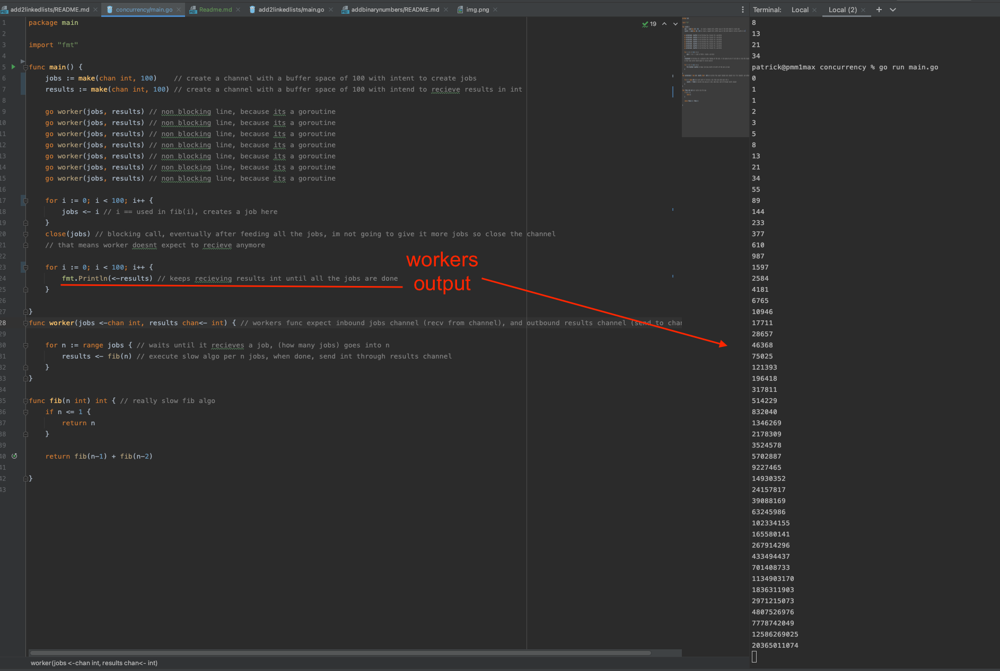
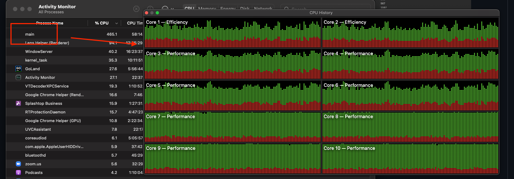

##This demonstrates one of the ways in which you can use concurrency in golang

This is a very simple example and hopefully easy enough for someone to understand!

1. make a slow fib function
2. make worker threads to process it

you should try:
1. playing with the number of workers
2. playing with number of jobs
3. create a deadlock when workers and jobs are not the same, then try to understand why (a: its all about the buffer channel space!)
4. add more go workers, reduce go workers

`every line is commented in main.go for the purpose of learning exactly what every line does`

`image above shows the `

The concept of golang concurrency was developed through
https://www.cs.ox.ac.uk/people/bill.roscoe/publications/68b.pdf

